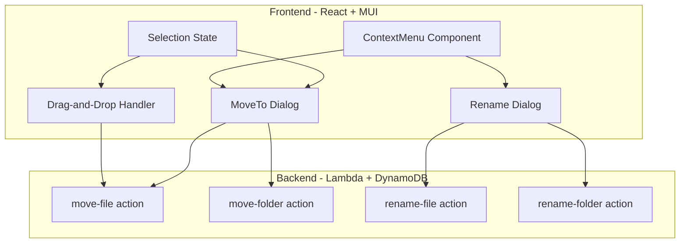

# File Management Features

## Architecture Overview




---

## 1. Backend: New API Actions

All new actions go through the existing `POST /upload` endpoint with an `action` field. Four new actions in [backend/lambdas/upload/handler.py](backend/lambdas/upload/handler.py):

### 1a. `move-file` action (in [files.py](backend/lambdas/upload/files.py))

- Request: `{ "action": "move-file", "fileId": "...", "destinationPath": "/target/folder" }`
- Logic:
  1. Query GSI1 to find the file by `fileId`, verify ownership
  2. Validate `destinationPath` exists (or is root `/`)
  3. Delete old DynamoDB item (`pk + old sk`)
  4. Insert new item with updated `sk = FILE#{destinationPath}/{filename}` and `path = destinationPath`
  5. S3 key stays unchanged (it uses `fileId`, not path)
- Returns: `{ "message": "File moved", "fileId": "...", "newPath": "..." }`

### 1b. `rename-file` action (in [files.py](backend/lambdas/upload/files.py))

- Request: `{ "action": "rename-file", "fileId": "...", "newName": "report-v2.pdf" }`
- Logic:
  1. Query GSI1, verify ownership
  2. Validate `newName` (no slashes, not empty, max 255 chars)
  3. Delete old DynamoDB item, insert new one with `sk = FILE#{path}/{newName}`, `filename = newName`
  4. S3 key stays unchanged -- the download handler already uses `Content-Disposition` with `filename` from DynamoDB, so the actual S3 object name doesn't matter
- Returns: `{ "message": "File renamed", "fileId": "...", "newName": "..." }`

### 1c. `move-folder` action (in [folders.py](backend/lambdas/upload/folders.py))

- Request: `{ "action": "move-folder", "folderPath": "/source", "destinationPath": "/target" }`
- Logic:
  1. Validate source exists, verify ownership
  2. Validate destination exists (or is root) and is not a descendant of source (prevent circular moves)
  3. Compute new path: `{destinationPath}/{folderName}`
  4. Query all items with `sk begins_with FOLDER#{sourcePath}` and `FILE#{sourcePath}/` to find all nested items
  5. Batch delete old items, batch write new items with updated path prefixes
- Returns: `{ "message": "Folder moved", "oldPath": "...", "newPath": "..." }`

### 1d. `rename-folder` action (in [folders.py](backend/lambdas/upload/folders.py))

- Request: `{ "action": "rename-folder", "folderPath": "/old-name", "newName": "new-name" }`
- Logic:
  1. Validate folder exists, verify ownership
  2. Compute new path by replacing the last path segment
  3. Re-key the folder plus all nested items (same batch approach as move-folder)
- Returns: `{ "message": "Folder renamed", "oldPath": "...", "newPath": "..." }`

---

## 2. Frontend: API Layer

Add four new functions to [frontend/src/api.ts](frontend/src/api.ts):

```typescript
export const moveFile = async (fileId: string, destinationPath: string): Promise<ApiResult> =>
  DriveApiClient.call<ApiResult>('/upload', { action: 'move-file', fileId, destinationPath });

export const renameFile = async (fileId: string, newName: string): Promise<ApiResult> =>
  DriveApiClient.call<ApiResult>('/upload', { action: 'rename-file', fileId, newName });

export const moveFolder = async (folderPath: string, destinationPath: string): Promise<ApiResult> =>
  DriveApiClient.call<ApiResult>('/upload', { action: 'move-folder', folderPath, destinationPath });

export const renameFolder = async (folderPath: string, newName: string): Promise<ApiResult> =>
  DriveApiClient.call<ApiResult>('/upload', { action: 'rename-folder', folderPath, newName });
```

Add matching service-layer wrappers in [frontend/src/service/driveService.ts](frontend/src/service/driveService.ts).

---

## 3. Frontend: Context Menu Component

Create [frontend/src/components/ContextMenu.tsx](frontend/src/components/ContextMenu.tsx):

- MUI `Menu` component positioned at right-click coordinates
- Takes a `target` prop: `{ type: 'file', file: DriveFile } | { type: 'folder', folder: DriveFolder } | null`
- Menu items with icons:
  - **Rename** (EditRoundedIcon) -- opens RenameDialog
  - **Move to...** (DriveFileMoveRoundedIcon) -- opens MoveDialog
  - **Download** (DownloadRoundedIcon) -- only for files, calls existing `handleDownload`
  - **Delete** (DeleteOutlineRoundedIcon) -- calls existing `handleDelete`/`handleDeleteFolder`
- Attach `onContextMenu` handlers to file cards, folder cards (GridLayout), and data grid rows (ListLayout)

---

## 4. Frontend: Rename Dialog

Create [frontend/src/components/RenameDialog.tsx](frontend/src/components/RenameDialog.tsx):

- MUI `Dialog` with a `TextField` pre-filled with the current name
- On submit, call `renameFile` or `renameFolder` depending on target type
- After success, call `loadFiles()` to refresh

---

## 5. Frontend: Move Dialog (Folder Picker)

Create [frontend/src/components/MoveDialog.tsx](frontend/src/components/MoveDialog.tsx):

- MUI `Dialog` showing a folder tree/list for the user to pick a destination
- Starts at root `/`, lets user navigate into subfolders
- Uses the existing `listFiles` API (action `list`) to fetch folder contents at each level
- "Move here" button to confirm the destination
- Supports moving multiple items (for bulk move)
- Excludes the source folder (and its descendants) from the tree when moving a folder

---

## 6. Frontend: Drag-and-Drop

Add HTML5 drag-and-drop to [GridLayout.tsx](frontend/src/components/GridLayout.tsx) and [ListLayout.tsx](frontend/src/components/ListLayout.tsx):

- **Draggable**: File cards and folder cards get `draggable="true"`, `onDragStart` sets `dataTransfer` with the item's id and type
- **Drop target**: Folder cards get `onDragOver` (prevent default + visual highlight) and `onDrop` (call `moveFile`/`moveFolder` API)
- Visual feedback: highlight folder border/background on drag-over
- After drop, call `loadFiles()` to refresh
- Support dropping multiple selected items at once

---

## 7. Frontend: Multi-Select and Bulk Operations

Add selection state to [App.tsx](frontend/src/App.tsx):

- New state: `selectedItems: Set<string>` (stores `fileId` or `folderId`)
- Click = select one (deselect others); Ctrl/Cmd+Click = toggle; Shift+Click = range
- Checkbox column in list view (DataGrid supports `checkboxSelection`)
- Selection overlay in grid view (checkbox on card hover)
- When multiple items are selected, right-click shows a bulk context menu with "Move to..." and "Delete"
- The MoveDialog accepts an array of items and calls move API for each one sequentially

---

## 8. Integration in App.tsx

Wire everything together in [App.tsx](frontend/src/App.tsx):

- Add state for: `contextMenu` (position + target), `renameTarget`, `moveTargets`, `selectedItems`
- Pass `onContextMenu` handlers down to GridLayout and ListLayout
- Render `ContextMenu`, `RenameDialog`, and `MoveDialog` as sibling components in the driveView JSX
- Add new handler functions: `handleRename`, `handleMove`, `handleBulkMove`

---

## File Change Summary


| File                                       | Change                                                               |
| ------------------------------------------ | -------------------------------------------------------------------- |
| `backend/lambdas/upload/handler.py`        | Add 4 new action routes                                              |
| `backend/lambdas/upload/files.py`          | Add `move_file()`, `rename_file()`                                   |
| `backend/lambdas/upload/folders.py`        | Add `move_folder()`, `rename_folder()`                               |
| `frontend/src/api.ts`                      | Add 4 API functions                                                  |
| `frontend/src/service/driveService.ts`     | Add service wrappers                                                 |
| `frontend/src/components/ContextMenu.tsx`  | **New** -- shared context menu                                       |
| `frontend/src/components/RenameDialog.tsx` | **New** -- rename dialog                                             |
| `frontend/src/components/MoveDialog.tsx`   | **New** -- folder picker dialog                                      |
| `frontend/src/components/GridLayout.tsx`   | Add drag-and-drop + context menu + selection                         |
| `frontend/src/components/ListLayout.tsx`   | Add context menu + checkbox selection                                |
| `frontend/src/components/File.ts`          | Update column factories (remove inline action buttons, add checkbox) |
| `frontend/src/App.tsx`                     | Add state, handlers, wire up new components                          |


